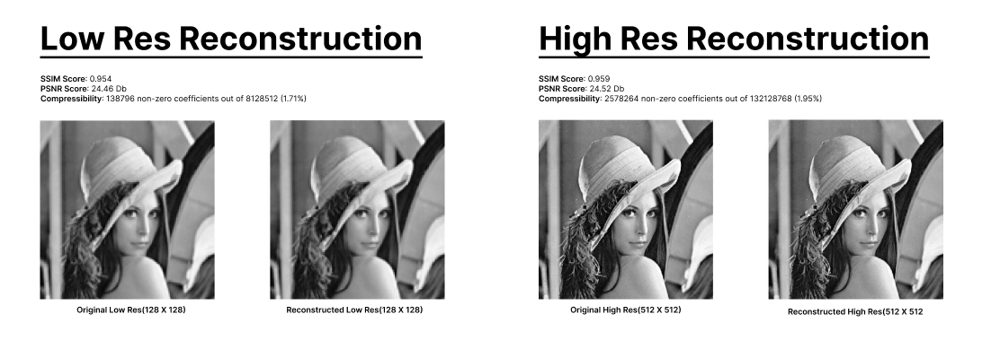
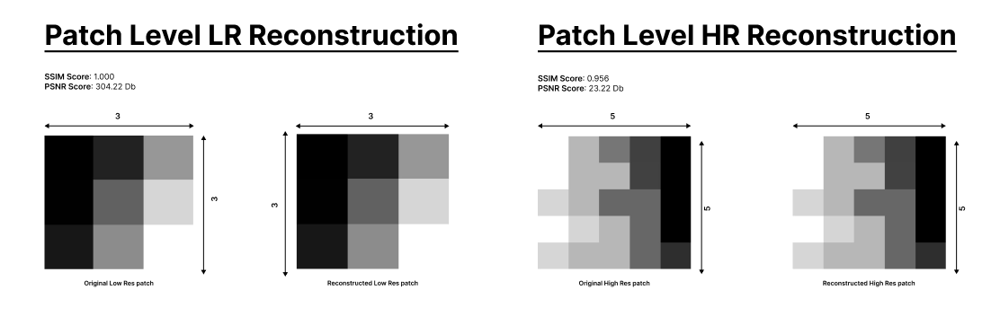
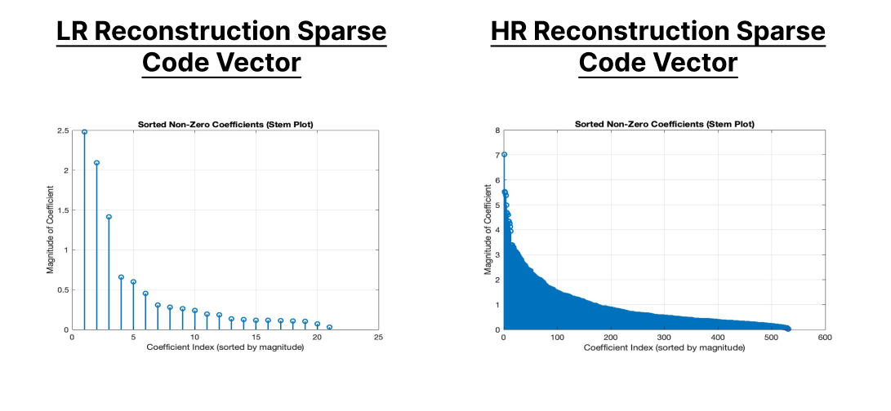

# Dictionary Learning with KSVD and Hyperparameter Tuning

This repository contains MATLAB scripts designed for image dictionary learning and reconstruction using the K-SVD algorithm and Orthogonal Matching Pursuit (OMP). Additionally, it provides tools for hyperparameter tuning through a grid search approach combined with 5-fold cross-validation.

## Prerequisites

Before proceeding, ensure you have the necessary toolboxes:

1. Download the `ksvdbox13` and `ompbox10` toolboxes from [here](https://csaws.cs.technion.ac.il/~ronrubin/software.html).
2. Obtain the Set14 dataset for training from [Kaggle Set14 Dataset](https://www.kaggle.com/datasets/ll01dm/set-5-14-super-resolution-dataset).

### Directory Setup

For smooth execution, adhere to the following directory structure:

```plaintext
.
├── Ksvd
│   ├── Images_Parameters
│   ├── Results
│   ├── Set14
│   └── code
└── ToolBoxes
    ├── ksvdbox13
    └── ompbox10

```

## Steps

### 1. **Path Setting and Initialization**:

- Load the user-specified image.

### 2. **User Options for Training**:

`TrainingScript.m` provides the following options:
1. Retrieve a pre-calculated grid search matrix.
2. Import best parameters from prior experiments.
3. Input training parameters manually.

Depending on the choice, the script fetches or prompts for parameters such as patch size, dictionary size (K), and sparsity constraints.

### 3. **Image Preprocessing**:

- Convert RGB images to grayscale.
- Create a low-resolution version of the high-resolution image via blurring and down-sampling.
- Segment the image into overlapping patches for dictionary training.

### 4. **Dictionary Learning and Sparse Representation**:

- If pre-defined best parameters aren't loaded, the script trains a dictionary `D` using the K-SVD algorithm.
- Apply Orthogonal Matching Pursuit (OMP) to get sparse representations (`GAMMA`) of the patches using the dictionary `D`.

### 5. **Image Reconstruction**:

- Use sparse codes and the dictionary to reconstruct the image.
- Rescale reconstructed image values to fit within the [0, 255] range.

### 6. **Evaluation**:

Determine the quality of the reconstructed image against the original using:
- SSIM (Structural Similarity Index)
- PSNR (Peak Signal-to-Noise Ratio)
- RMSE (Root Mean Square Error)

### 7. **Visualization**:

Here's a visual representation of the reconstruction process:

1. **Reconstruction of Complete Image**: 
   
    

   *Displaying the side-by-side comparison of Original LR, Reconstructed LR, Original HR, and Reconstructed HR with respective SSIM and PSNR scores.*

2. **Reconstruction of a Single Patch**: 
   
    

   *Illustrating a singular patch's reconstruction process.*

3. **Sparse Vector Visualization**:
   
   

   *Stem plot representing a sparse vector, highlighting the power law decay.*


## Final Notes

To run the script effectively, ensure that functions like `LowResImage`, `Training`, `SinglePatchReconstructV2`, `compressibility`, `plotResultsMatrix`, and `reconstruct_from_patches_2d` are correctly imported and referenced.

